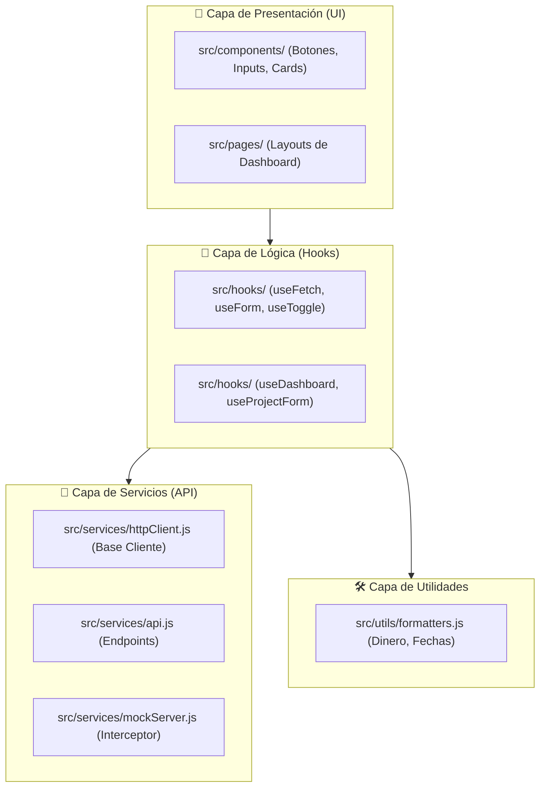
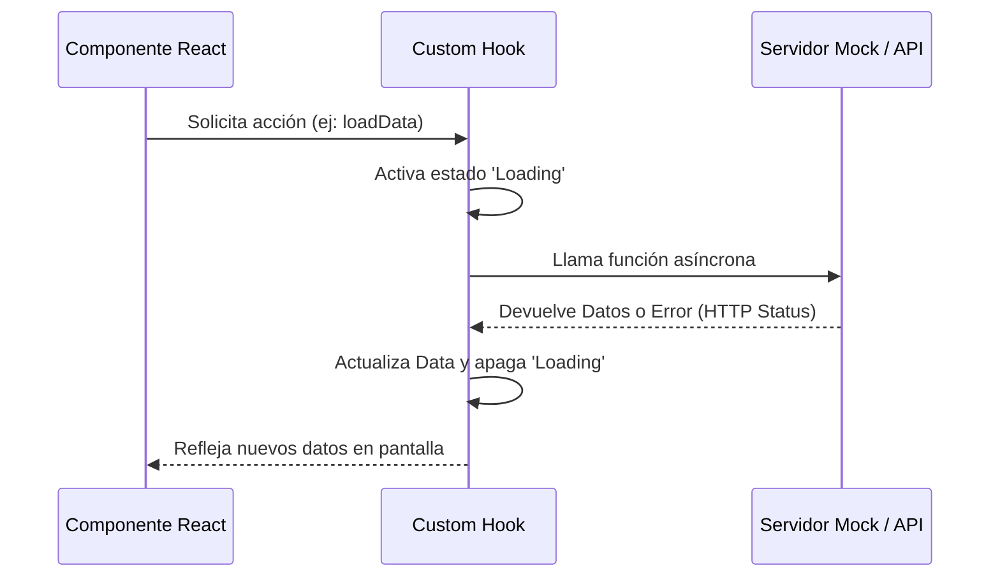

# 🏢 APM Enterprise: Dashboard Management System

## 📝 Resumen del Proyecto
Sistema de gestión empresarial de alto rendimiento diseñado para **APM Enterprise**. Este proyecto demuestra la transición de una aplicación legada hacia una **Arquitectura de Software Profesional**, priorizando la escalabilidad, el mantenimiento predictivo y el desacoplamiento total de responsabilidades.

---

## 🏗️ Arquitectura de Capas Profesionales

Para asegurar la calidad empresarial, el sistema está dividido en 4 capas de responsabilidad única:

---

## 📈 Bitácora de Desarrollo Diaria

### 📅 Día 1: Arquitectura y Refactorización Base
Este día se centró en "limpiar la casa". El código desordenado fue fragmentado en sub-actividades de alta especialización:

*   **[📦 Actividad 1.1: Modularización UI](./docs/ACTIVIDAD_1_1.md)**: Extracción de componentes atómicos para crear una librería de diseño interna.
*   **[📡 Actividad 1.2: Aislamiento de Servicios](./docs/ACTIVIDAD_1_2.md)**: Centralización de llamadas a la API en una capa independiente.
*   **[🛠️ Actividad 1.3: Abstracción Funcional](./docs/ACTIVIDAD_1_3.md)**: Creación de formateadores globales para consistencia visual.
*   **[🎣 Actividad 1.4: Desacoplamiento de Lógica](./docs/ACTIVIDAD_1_4.md)**: Primeros pasos moviendo estado complejo a hooks locales.
*   [🔍 Auditoría de Calidad Día 1](./docs/AUDITORIA_DIA_1.md)

### 📅 Día 2: Custom Hooks Profesionales
Enfocado en la creación de herramientas de nivel Senior para gestionar efectos y estados complejos.

*   **[🎣 Actividad 2: Implementación de Hooks Genéricos](./docs/ACTIVIDAD_2.md)**:
    *   **`useFetch`**: Manejo de peticiones con `AbortController` y estados de error/carga.
    *   **`useForm`**: Gestión de inputs con validación en tiempo real y soporte para reseteo.
    *   **`useToggle`**: Utilidad profesional para control de booleanos.
*   [🧪 Auditoría de Lógica Día 2](./docs/AUDITORIA_DIA_2.md)

---

## 📊 Tabla de Estructura de Proyecto

| Directorio | Propósito | Regla de Oro |
| :--- | :--- | :--- |
| `src/components/` | Componentes visuales puros. | Prohibido hacer `fetch` o lógica de negocio. |
| `src/hooks/` | Cerebro de la aplicación. | Único lugar permitido para gestionar estados complejos. |
| `src/services/` | Puerta al mundo exterior. | Debe ser independiente de la UI (agnóstico de React). |
| `src/utils/` | Herramientas comunes. | Solo funciones puras (entrada -> salida). |

---

## 🔄 Flujo de Datos Profesional

---

*Proyecto desarrollado como parte del curso de Especialización en React Profesional.*
