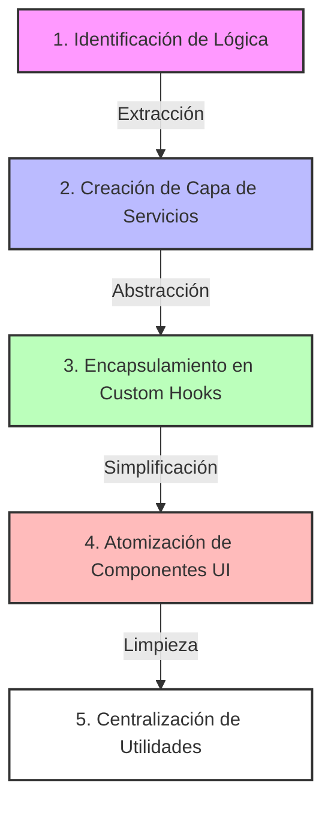
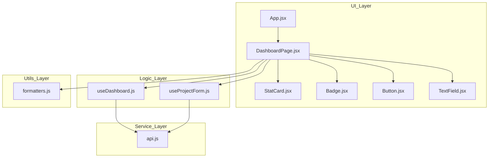

# 🏢 APM Enterprise: Dashboard Management System

[](https://reactjs.org/)
[](https://vitejs.dev/)
[](https://developer.mozilla.org/en-US/docs/Web/JavaScript)
[](https://www.w3.org/TR/CSS/)

## 📝 Resumen del Proyecto
Este es un sistema de gestión empresarial diseñado para **APM Enterprise**, enfocado en la administración eficiente de proyectos y métricas de rendimiento (KPIs). El objetivo principal es migrar sistemas heredados hacia una arquitectura moderna basada en React, garantizando la escalabilidad, el mantenimiento preventivo y una experiencia de usuario premium.

Estamos trabajando bajo un esquema de **Arquitectura Profesional**, separando estrictamente las responsabilidades para evitar el código espagueti y asegurar que el sistema pueda crecer junto con las necesidades de la empresa.

---

## 📈 Bitácora de Desarrollo: Día 1 — React Arquitectura Profesional

Este día se centra en asegurar las bases de React, entendiendo que la arquitectura y la separación de responsabilidades son la clave para un código escalable.

### [📦 Actividad 1: Auditoría y Refactorización](./docs/ACTIVIDAD_1.md)
*   **Enfoque:** Separación de responsabilidades.
*   **Logros:** Migración de un monolito a una estructura modular (`services`, `hooks`, `components`, `utils`).
*   [Ver Auditoría Actividad 1](#audit-dia-1)

### [🎣 Actividad 2: Custom Hooks Profesionales](./docs/ACTIVIDAD_2.md)
*   **Enfoque:** Abstracción de lógica y limpieza de componentes.
*   **Logros:** Implementación de `useFetch`, `useForm` y `useToggle` genéricos con manejo de estados y limpieza de memoria.
*   [Ver Auditoría Actividad 2](#audit-dia-2)

### [📡 Actividad 3: Integración con API Profesional](./docs/ACTIVIDAD_3.md)
*   **Enfoque:** Cliente HTTP centralizado y manejo de errores reales.
*   **Logros:** Creación de `httpClient.js` y `mockServer.js` para interceptación de `fetch`, simulando un backend empresarial con estados 401, 404 y 500.

### [🤝 Actividad 4: Pair Programming & Refactor Final](./docs/ACTIVIDAD_4.md)
*   **Enfoque:** Revisión de calidad de código y eliminación de acoplamiento.
*   **Logros:** Auditoría completa de arquitectura ("Navigator"), asegurando que la lógica esté 100% aislada en hooks y los servicios sean totalmente independientes de la UI.

---

## 🚀 Proceso de Refactorización Paso a Paso

Para lograr una arquitectura limpia, seguimos este flujo de trabajo para delegar responsabilidades correctamente:



| Fase | Acción Realizada | Resultado |
| :--- | :--- | :--- |
| **1. Identificación** | Se analizaron las funciones de API y lógica de estado mezcladas en el JSX. | Mapa de dependencias claro. |
| **2. Servicios** | Extracción de `apiGetDashboard`, `apiCreateProject` a `src/services/api.js`. | Independencia de la fuente de datos. |
| **3. Common Hooks** | Creación de `useDashboard` y `useProjectForm` para manejar el estado complejo. | UI libre de lógica de negocio. |
| **4. UI Components** | Separación de `Button`, `StatCard`, `Badge` a `src/components/`. | Componentes puros y reutilizables. |
| **5. Utilities** | Movimiento de formateadores (`money`) a `src/utils/formatters.js`. | Código DRY (Don't Repeat Yourself). |

## 🏗️ Arquitectura del Proyecto

Hemos separado el código en capas lógicas para asegurar que la UI sea independiente de la lógica de negocio y de los servicios de datos.



## 📂 Estructura de Carpetas

```text
src/
├── components/ # Componentes atomizados y sin lógica.
├── hooks/      # Lógica de negocio y estado encapsulado.
├── services/   # Comunicación con APIs externas.
├── pages/      # Composición de componentes y hooks.
├── utils/      # Funciones auxiliares genéricas.
└── App.jsx     # Punto de entrada de la aplicación.
```

<a name="audit-dia-1"></a>
## 📝 Auditoría React (Día 1)

A continuación, se responden las preguntas planteadas en la actividad de auditoría:

### 1. ¿Por qué moviste esta lógica a un hook?
Movimos la lógica a custom hooks (`useDashboard`, `useProjectForm`) para **separar la lógica de negocio de la interfaz de usuario**. Esto permite que el código sea:
- **Reutilizable:** La misma lógica puede usarse en otros componentes.
- **Testeable:** Es más fácil testear funciones aisladas que componentes con lógica interna.
- **Limpio:** El JSX se mantiene enfocado solo en "cómo se ve" la aplicación.

### 2. ¿Qué pasa si mañana cambia la API?
Gracias a la centralización en `src/services/api.js`, solo tendríamos que modificar ese archivo. Los hooks y componentes no necesitan saber si los datos vienen de un `fetch`, de `axios` o de un archivo local; ellos solo consumen las funciones exportadas por el servicio.

### 3. ¿Dónde colocar las validaciones?
Las validaciones deben colocarse en los **custom hooks** (como hicimos en `useProjectForm`) o en archivos dentro de `src/utils/` si son validaciones genéricas. Nunca deben estar mezcladas directamente en el JSX, para evitar que la UI sea responsable de reglas de negocio.

### 4. ¿Por qué este componente no debería tener fetch directo?
Un componente con `fetch` directo está **acoplado** a una implementación de datos específica. Esto dificulta:
- Cambiar la fuente de datos en el futuro.
- Reutilizar el componente en contextos donde los datos ya existen o vienen de otra parte.
- Realizar pruebas unitarias sin mockear toda la red.

---

<a name="audit-dia-2"></a>
## 🧪 Auditoría React (Día 2)

### 1. ¿Qué problema resuelve un custom hook?
Resuelven la **duplicación de lógica de estado y efectos**. Permiten extraer la lógica compleja de los componentes para que estos se enfoquen solo en la interfaz de usuario, facilitando la reutilización en múltiples partes de la empresa y simplificando las pruebas unitarias.

### 2. ¿Cuándo NO se debe usar un hook?
No se deben usar cuando la lógica es puramente algorítmica y no depende del ciclo de vida o del estado de React. Si es una función que solo transforma datos, debe vivir en `src/utils/` como un helper. Tampoco deben usarse para lógica que no será reutilizada y que es simple de mantener dentro del componente.

### 3. ¿Qué pasa si el hook depende de props cambiantes?
El hook debe incluir esas props en los arreglos de dependencias de sus propios hooks internos (`useEffect`, `useCallback`, `useMemo`). Esto asegura que el hook se sincronice correctamente y reaccione a los cambios de configuración externa, manteniendo la consistencia de los datos.

### 4. ¿Dónde está el riesgo de memory leak?
El riesgo principal está en los **efectos secundarios asíncronos** (peticiones API, suscripciones, temporizadores) que no se limpian cuando el componente se desmonta. Por ello, en nuestro `useFetch` implementamos un `AbortController` para cancelar cualquier petición pendiente y evitar que el estado intente actualizarse en un componente que ya no existe.

---

*Proyecto desarrollado como parte del curso React Profesional para APM Enterprise.*
