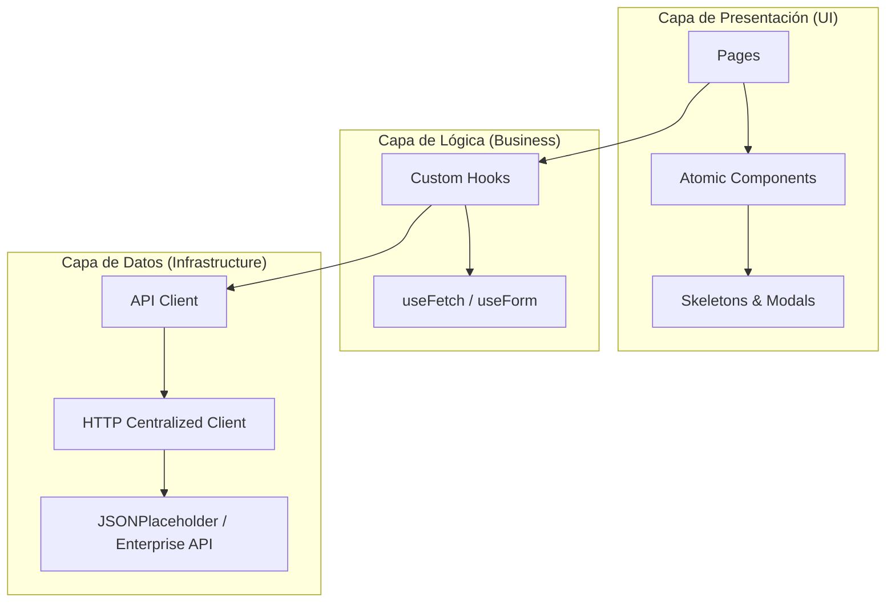
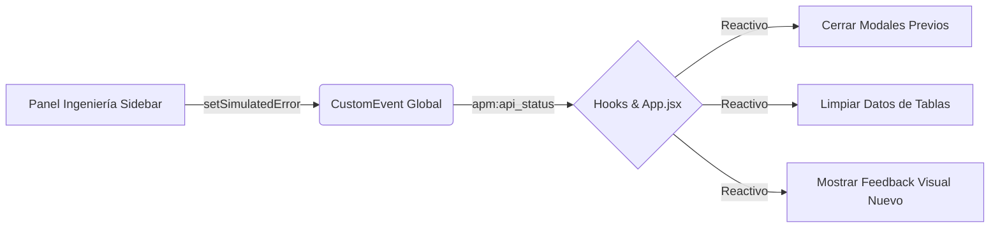

# APM Enterprise - Auditoría de Red 🚀

Ecosistema de gestión de red de grado empresarial, diseñado bajo los más altos estándares de arquitectura profesional en React. Este proyecto documenta la evolución técnica a través de 3 sprints intensivos.

---

## 🏛️ Arquitectura Global del Sistema

El sistema utiliza un patrón de **Separación de Preocupaciones (SoC)** absoluto, dividiendo la aplicación en capas desacopladas que permiten un mantenimiento senior.

---

## 📈 Roadmap de Desarrollo Profesional

Haz clic en cada fase para ver los **diagramas detallados** y la ingeniería aplicada en cada etapa:

1.  👉 **[Día 1: Refactorización y Estructura Core](./docs/FASE_1_ESTRUCTURA.md)**
    *Refactorización de monolito a arquitectura por capas.*
2.  👉 **[Día 2: Lógica Senior y Custom Hooks](./docs/FASE_2_LOGICA.md)**
    *Abstracción de patrones de red y formularios.*
3.  👉 **[Día 3: UI Premium e Integridad de API](./docs/FASE_3_PREMIUM.md)**
    *Diseño dinámico y sistema de simulación de errores.*

---

## 🚨 Gestión de Protocolos y Errores (Ingenieria de Red)

El sistema implementa una **Auditoría de Red Activa** que permite diagnosticar fallos mediante una consola de ingeniería integrada en el Sidebar.

### Matriz de Respuesta a Errores
| Código | Estado Técnico | Comportamiento del Sistema | Visual (Modal) |
| :--- | :--- | :--- | :--- |
| **200** | **SUCCESS** | Restaura flujos de datos inmediatamente. | **Esmeralda** |
| **401** | **AUTH FAIL** | Limpia caché local y notifica expiración de sesión. | **Violeta** |
| **404** | **NOT FOUND** | Renderiza "Empty State" específico del recurso. | **Azul** |
| **500** | **CORE FAIL** | Dispara protocolo de emergencia y limpia tablas. | **Rojo** |

### Flujo de Simulación de Errores

---
**Desarrollado para la Evaluación de Arquitectura React - APM v3.0 Premium**
