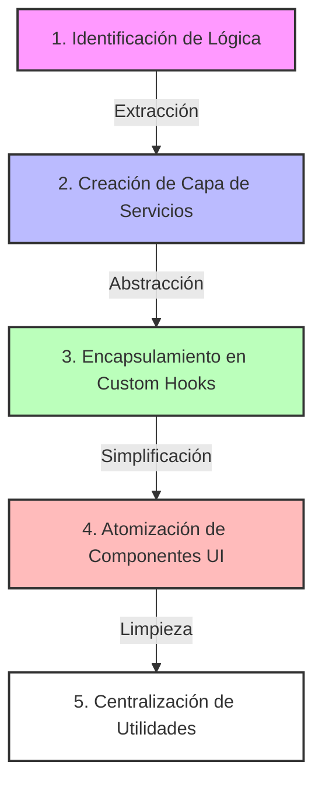
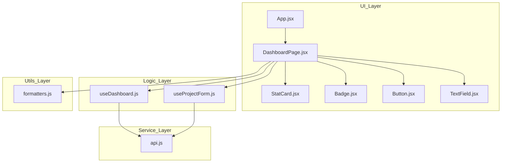

# React Profesional: Arquitectura Antes del Framework

[](https://reactjs.org/)
[](https://vitejs.dev/)
[](https://developer.mozilla.org/en-US/docs/Web/JavaScript)
[](https://www.w3.org/TR/CSS/)

Este proyecto es el resultado del **Día 1 — React Arquitectura Profesional**. Se ha refactorizado una aplicación desordenada ("todo-en-uno") hacia una estructura escalable y mantenible, siguiendo los principios de separación de responsabilidades.

## 🚀 Proceso de Refactorización Paso a Paso

Para lograr una arquitectura limpia, seguimos este flujo de trabajo para delegar responsabilidades correctamente:



| Fase | Acción Realizada | Resultado |
| :--- | :--- | :--- |
| **1. Identificación** | Se analizaron las funciones de API y lógica de estado mezcladas en el JSX. | Mapa de dependencias claro. |
| **2. Servicios** | Extracción de `apiGetDashboard`, `apiCreateProject` a `src/services/api.js`. | Independencia de la fuente de datos. |
| **3. Common Hooks** | Creación de `useDashboard` y `useProjectForm` para manejar el estado complejo. | UI libre de lógica de negocio. |
| **4. UI Components** | Separación de `Button`, `StatCard`, `Badge` a `src/components/`. | Componentes puros y reutilizables. |
| **5. Utilities** | Movimiento de formateadores (`money`) a `src/utils/formatters.js`. | Código DRY (Don't Repeat Yourself). |

## 🏗️ Arquitectura del Proyecto

Hemos separado el código en capas lógicas para asegurar que la UI sea independiente de la lógica de negocio y de los servicios de datos.



## 📂 Estructura de Carpetas

```text
src/
├── components/ # Componentes atomizados y sin lógica.
├── hooks/      # Lógica de negocio y estado encapsulado.
├── services/   # Comunicación con APIs externas.
├── pages/      # Composición de componentes y hooks.
├── utils/      # Funciones auxiliares genéricas.
└── App.jsx     # Punto de entrada de la aplicación.
```

## 📝 Auditoría React (Día 1)

A continuación, se responden las preguntas planteadas en la actividad de auditoría:

### 1. ¿Por qué moviste esta lógica a un hook?
Movimos la lógica a custom hooks (`useDashboard`, `useProjectForm`) para **separar la lógica de negocio de la interfaz de usuario**. Esto permite que el código sea:
- **Reutilizable:** La misma lógica puede usarse en otros componentes.
- **Testeable:** Es más fácil testear funciones aisladas que componentes con lógica interna.
- **Limpio:** El JSX se mantiene enfocado solo en "cómo se ve" la aplicación.

### 2. ¿Qué pasa si mañana cambia la API?
Gracias a la centralización en `src/services/api.js`, solo tendríamos que modificar ese archivo. Los hooks y componentes no necesitan saber si los datos vienen de un `fetch`, de `axios` o de un archivo local; ellos solo consumen las funciones exportadas por el servicio.

### 3. ¿Dónde colocar las validaciones?
Las validaciones deben colocarse en los **custom hooks** (como hicimos en `useProjectForm`) o en archivos dentro de `src/utils/` si son validaciones genéricas. Nunca deben estar mezcladas directamente en el JSX, para evitar que la UI sea responsable de reglas de negocio.

### 4. ¿Por qué este componente no debería tener fetch directo?
Un componente con `fetch` directo está **acoplado** a una implementación de datos específica. Esto dificulta:
- Cambiar la fuente de datos en el futuro.
- Reutilizar el componente en contextos donde los datos ya existen o vienen de otra parte.
- Realizar pruebas unitarias sin mockear toda la red.

---

*Proyecto desarrollado como parte de la Actividad 1 del curso React Profesional.*
