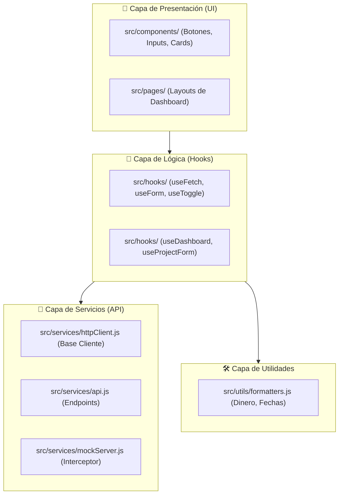
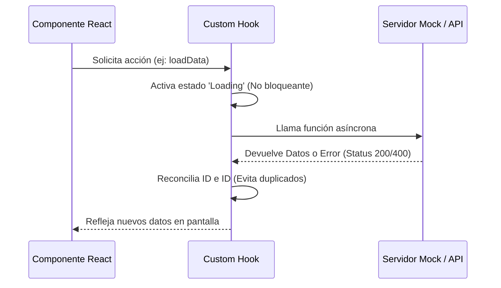

# 🏢 APM Enterprise: Dashboard de Excelencia v3.5

## 💎 El Estándar de Oro en Gestión de Proyectos
Ecosistema empresarial sistemático diseñado para **APM Enterprise**. Esta plataforma representa la cúspide de la **Ingeniería de Software Moderna**, priorizando el desacoplamiento de capas, el mantenimiento predictivo y una experiencia de usuario de élite.

---

## 🏗️ Ingeniería de Capas Profesionales

Para asegurar la calidad empresarial, el sistema está dividido en 4 capas de responsabilidad única:

---

## 🔄 Flujo de Datos Profesional

El sistema implementa un ciclo de vida de datos asíncrono y controlado:

---

## 📈 Bitácora de Ingeniería (Castro y Saravia)

### 📅 Fase 1: Estructura y Modularización
Enfoque en la creación del sistema de diseño y aislamiento de servicios.
- 📦 Modularización de la UI Atómica.
- 📡 Aislamiento de Servicios (API agnóstica).
- 🛠️ Abstracción de Utilidades Globales.
- **[Consultar Documentación Fase 1](./docs/FASE_1_ESTRUCTURA.md)**

### 📅 Fase 2: Lógica Senior y Hooks
Implementación de herramientas de control de estado y efectos a nivel Senior.
- 🎣 `useFetch` con AbortControllers.
- 📋 `useForm` con validación real-time.
- 🔄 `useToggle` profesional.
- **[Consultar Documentación Fase 2](./docs/FASE_2_LOGICA.md)**

### 📅 Fase 3: Refinamiento Premium e Integridad Elite
Fase final de pulido estético y corrección de integridad operativa.
- 🎨 Tooltips Premium y Simetría de Sidebar.
- 🆔 **Identidad de Proyecto**: Visualización de IDs únicos integrados desde la API.
- ⚡ **Consumo de API Resiliente**: Gestión avanzada de errores (404/500) con feedback visual dinámico.
- 🛡️ Solución definitiva al Bug de Duplicación mediante reconciliación atómica.
- **[Consultar Documentación Fase 3](./docs/FASE_3_PREMIUM.md)**

---

## 🛠️ Stack Tecnológico
- **Frontend**: React 18 / Vite / Lucide Icons
- **Estado/Lógica**: Custom Hooks (Clean Code Patterns)
- **Network**: Cliente HTTP centralizado (Axios Pattern)
- **Estilo**: CSS Vanilla / Enterprise Tokens / Animaciones Premium
- **Documentación**: Mermaid Diagrams / Markdown Elite

--- 

*Desarrollado con excelencia por el equipo de ingeniería **Castro y Saravia**.*
