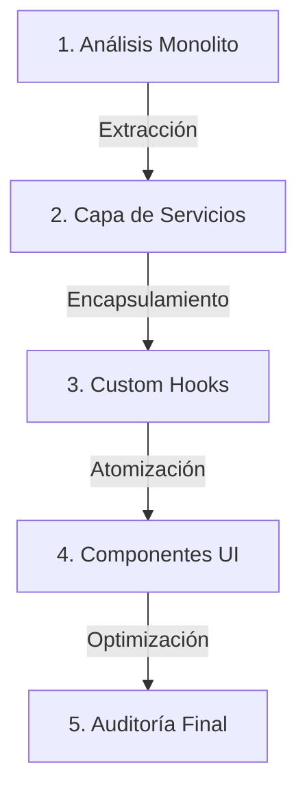
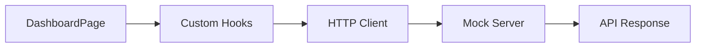

# 🏢 APM Enterprise: Dashboard Management System

## 📝 Resumen del Proyecto
Este es un sistema de gestión empresarial diseñado para **APM Enterprise**, enfocado en la administración eficiente de proyectos y métricas de rendimiento (KPIs). El sistema utiliza una **Arquitectura Profesional** de capas, garantizando escalabilidad y mantenimiento preventivo.

---

## 📈 Bitácora de Desarrollo: Día 1 — React Arquitectura Profesional

A continuación, se detallan las actividades del Día 1. Haz clic en cada una para ver el informe detallado y la auditoría correspondiente:

### 🗂️ Índice de Actividades
1.  **[📦 Actividad 1: Auditoría y Refactorización](./docs/ACTIVIDAD_1.md)**
    *   Migración de monolito a estructura modular.
    *   Auditoría de responsabilidades.
2.  **[🎣 Actividad 2: Custom Hooks Profesionales](./docs/ACTIVIDAD_2.md)**
    *   Abstracción de lógica con `useFetch`, `useForm` y `useToggle`.
    *   Auditoría de estados y efectos.
3.  **[📡 Actividad 3: Integración con API Profesional](./docs/ACTIVIDAD_3.md)**
    *   Cliente HTTP centralizado y Servidor Mock.
    *   Manejo de estados de carga y errores HTTP.
4.  **[🤝 Actividad 4: Pair Programming & Refactor Final](./docs/ACTIVIDAD_4.md)**
    *   Auditoría de calidad ("Navigator").
    *   Desacoplamiento total y optimización.

---

## 🏗️ Mapa de Arquitectura y Flujo

### Proceso de Refactorización

### Tabla de Responsabilidades
| Capa | Ubicación | Responsabilidad |
| :--- | :--- | :--- |
| **UI** | `src/components/` | Solo presentación y estilos puros. |
| **Logic** | `src/hooks/` | Gestión de estado y reglas de negocio. |
| **Services** | `src/services/` | Comunicación con API y manejo de datos. |
| **Utils** | `src/utils/` | Funciones auxiliares genéricas. |

### Diagrama de Flujo de Datos

---

*Proyecto desarrollado como parte del curso React Profesional para APM Enterprise.*
