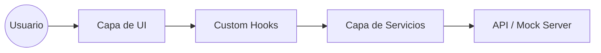

# 🤝 Actividad 4: Pair Programming & Refactor Final

## 🎯 Objetivo
Realizar una revisión de calidad exhaustiva bajo el rol de "Navigator", asegurando que el código cumpla con los estándares de **APM Enterprise**.

## 🛡️ Auditoría de Calidad ("Navigator")
*   **Acoplamiento Zero:** Los componentes no saben de dónde vienen los datos; solo los reciben.
*   **Separación de Conceptos:** La lógica de formularios (`useForm`) está separada de la lógica de datos (`useFetch`).
*   **Optimización de Render:** Uso de `useCallback` en funciones pasadas a componentes hijos para prevenir re-renderizados innecesarios.
*   **Código Limpio:** Eliminación de comentarios obsoletos y uso de nombres de variables descriptivos.

## 📐 Diagrama de Flujo Final

---
[⬅️ Volver al Home](../README.md)
