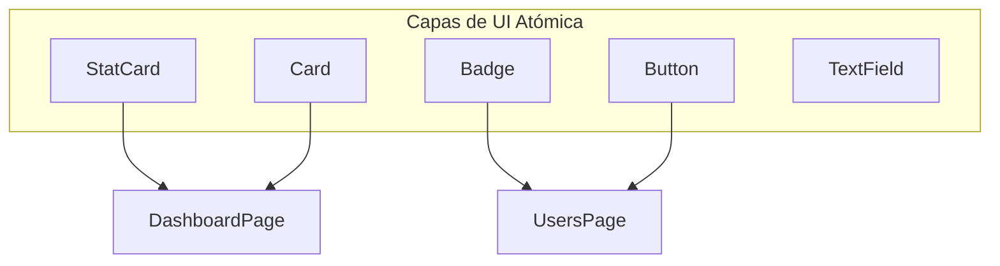
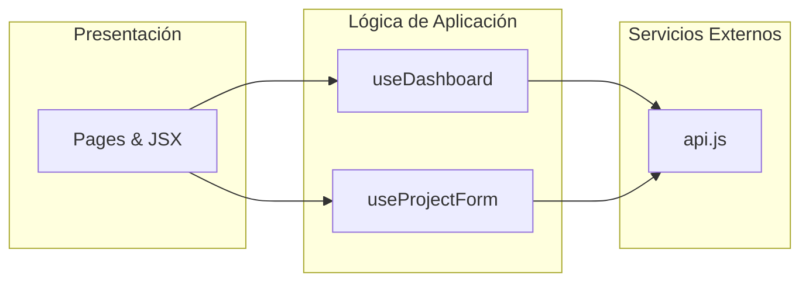

# 🏗️ Fase 1: Arquitectura y Cimientos Estructurales

## 🎯 Objetivo de la Fase
Transformar una aplicación monolítica "Todo-en-Uno" en un ecosistema de software modular, escalable y profesional, eliminando el acoplamiento entre UI y datos.

## 🛠️ Ingeniería de Componentes Atómicos
Se fragmentó la interfaz en componentes puros que no manejan lógica de negocio, solo renderizan propiedades:

## 📡 Aislamiento de Capas (Refactor)
Se aplicó una **Arquitectura de Capas Verticales** para asegurar que el cambio en un servicio no afecte la presentación:

### Hitos Logrados:
1.  **Eliminación de Fetch en Pantalla**: Las páginas ya no saben cómo traer datos.
2.  **Modularización**: Cada archivo tiene una única responsabilidad (SRP).
3.  **UI Agnóstica**: Los componentes se pueden reutilizar en cualquier sección del sistema.

---
[⬅️ Volver al Roadmap Principal](../README.md)
