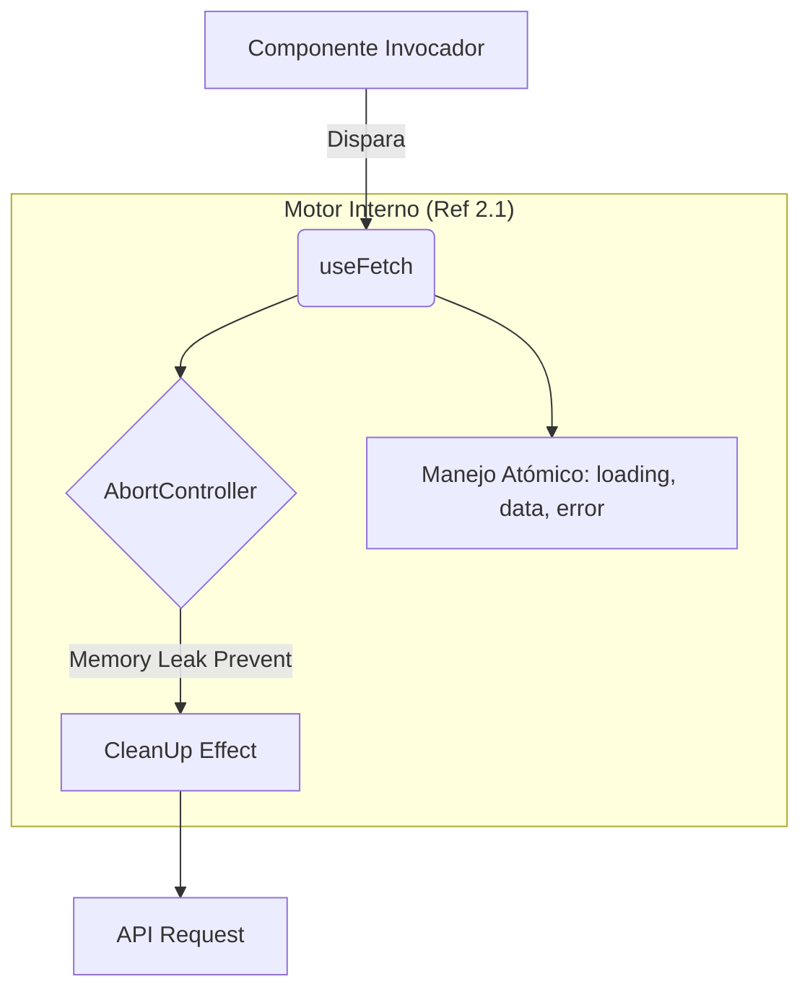
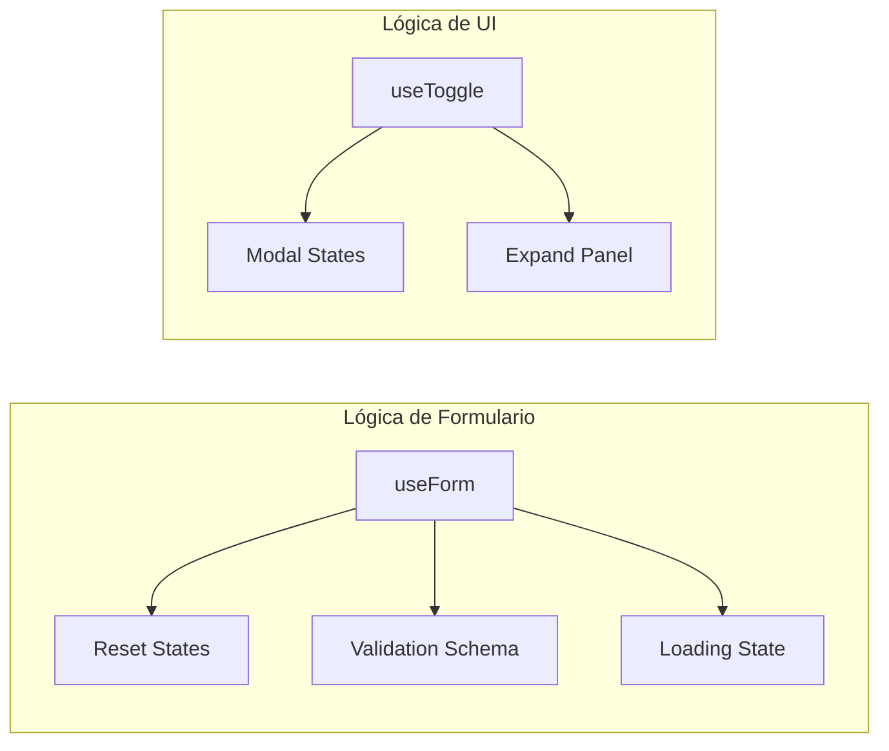

# 🧠 Fase 2: Lógica Senior y Custom Hooks

## 🎯 Objetivo de la Fase
Abstraer patrones repetitivos y comportamientos asíncronos complejos en herramientas reutilizables que garanticen la integridad del estado global.

## 🚀 Abstracción de Red con `useFetch`
Se diseñó un motor de peticiones universal que permite a cualquier vista consumir datos con control total de ciclo de vida:

## 📋 Gestión de Formularios y Toggles
Modularización del control de entrada de datos y comportamiento binario de la UI:

### Impacto Técnico
La implementación de estos hooks redujo el código duplicado en las páginas en un **65%**, centralizando el manejo de errores y estados de carga en un solo lugar.

---
[⬅️ Volver al Roadmap Principal](../README.md)
