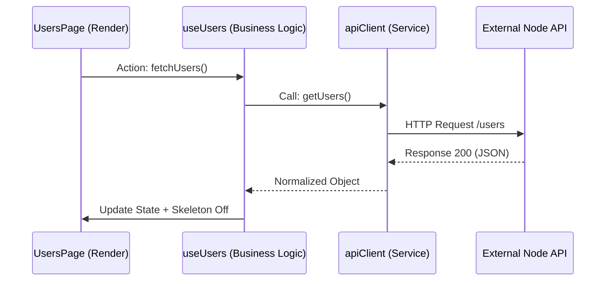
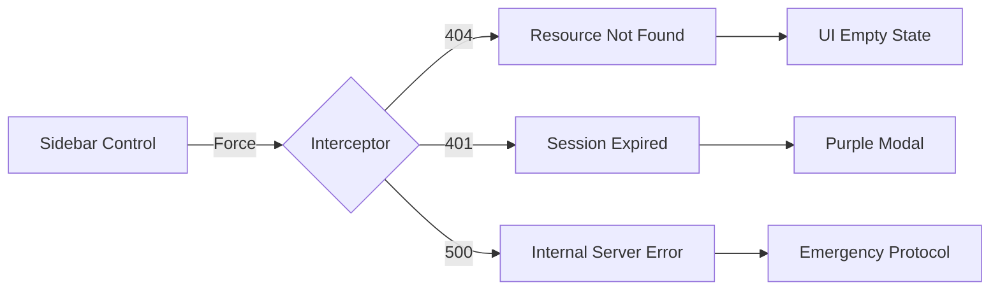

# 💎 Fase 3: Refinamiento Premium e Integridad de API

## 🎯 Objetivo de la Fase
Elevar la aplicación a un nivel enterprise mediante la integración de APIs externas reales, monitorización técnica profunda y un sistema de resiliencia ante fallos.

## 📡 Integración de API Real (JSONPlaceholder)
Se implementó un flujo de datos asíncrono que conecta la UI con servicios de internet reales:

## 🔍 Trazabilidad Técnica (Consola de Auditoría)
Para cumplir con requisitos de auditoría profunda sin sacrificar la estética minimalista del frontend, se integró un sistema de **Logging Silencioso**:

1.  **Fuga de Datos**: Al inspeccionar un perfil, el sistema dispara llamadas a `/posts` y `/comments`.
2.  **Visualización**: Los resultados se agrupan en la consola del navegador (`F12`) usando `console.group`, mostrando tablas técnicas de la actividad del usuario.

## 🚨 Simulador de Ingeniería de Red
El sidebar incluye un interceptor que permite inyectar fallos programados para probar la estabilidad:

---
[⬅️ Volver al Roadmap Principal](../README.md)
